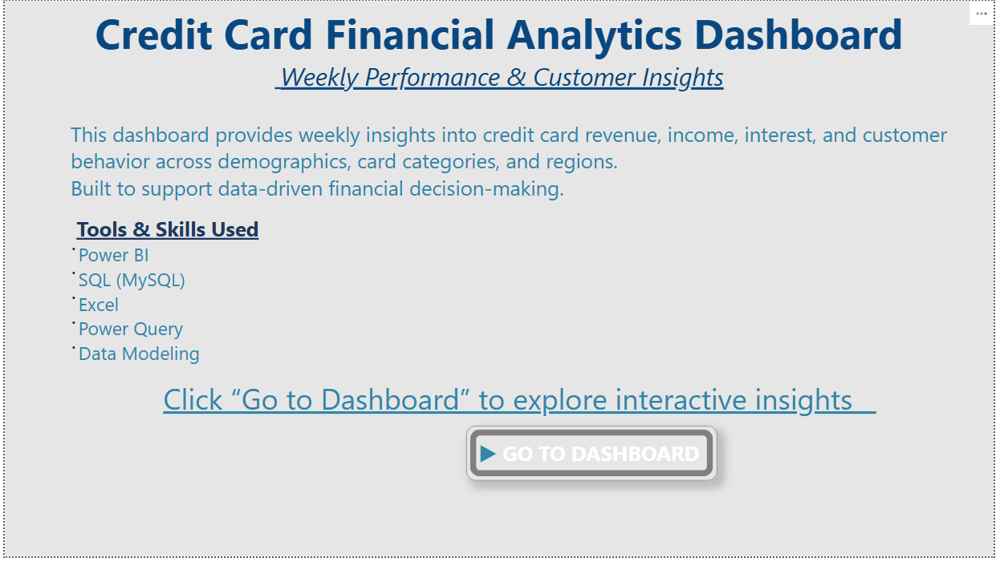
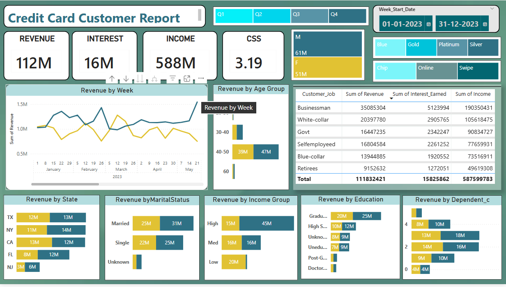

# Credit Card Financial Analytics Dashboard

## 📌 Project Overview
An end-to-end Power BI dashboard analyzing credit card revenue, interest, income, and customer behavior with weekly performance insights to support data-driven decision-making.

---

## 🖼 Dashboard Preview

### 🏠 Home Page

### 💳 Credit Card Transaction Report

### 👥 Credit Card Customer Report

### 📊 Key Insights & Business Takeaways

---

## 📊 Key KPIs
- Total Revenue
- Total Interest
- Total Income
- Weekly Revenue Trends
- Customer Segmentation

---

## 🛠 Tools & Technologies
Power BI | SQL (MySQL) | Excel | Power Query | Data Modeling

---

## 👤 Author
**Bhanu Kumar**

